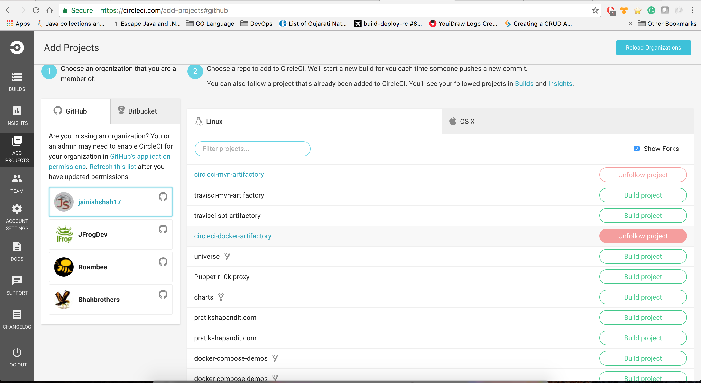
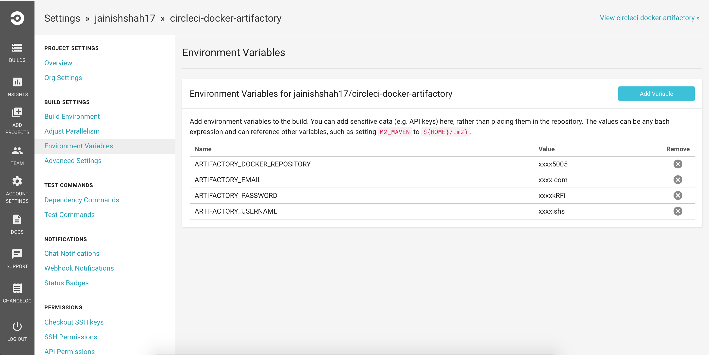
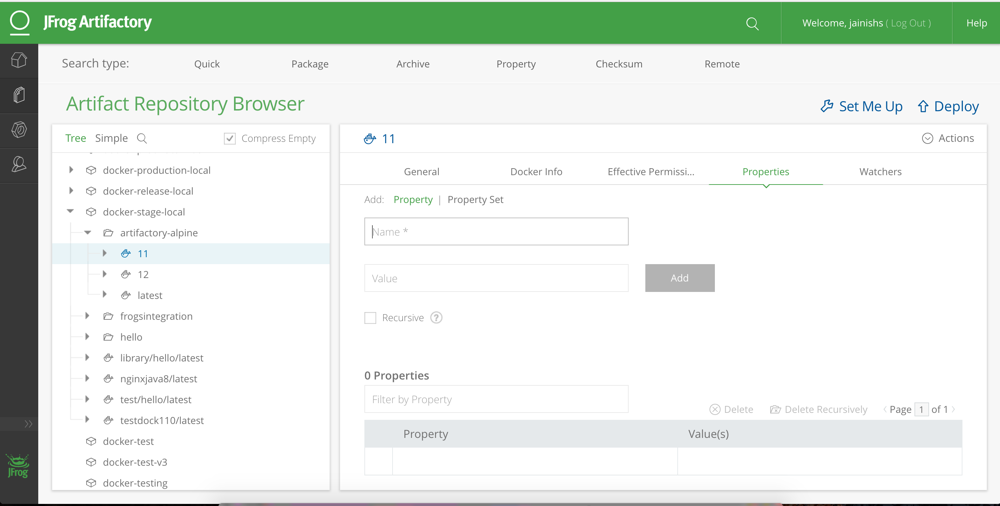

# Artifactory Integration with Circle CI
## Store build information and build artifacts to JFrog Artifactory
## Build Status [](https://circleci.com/gh/jainishshah17/circleci-docker-artifactory)

`To make this integration work you will need to have running Artifactory-Enterprise/Artifactory-pro/Artifactory SAAS.`

#### Command to test npm package:

* Set npm command line client to work with [Artifactory Npm Registry](https://www.jfrog.com/confluence/display/RTF/Npm+Registry).
    create `.npmrc` file and paste following content to it:
    
```
registry = https://$ARTIFACTORY_URL/api/npm/$ARTIFACTORY_NPM_REPO_NAME/
_auth = $ARTIFACTORY_USER:$ARTIFACTORY_PASSWORD
email = youremail@email.com
always-auth = true
```

* Install dependencies: `npm install`
* Start node Server: `npm start` 
* Test node package: `npm test` 
* Access Application on: [http://localhost:3000](http://localhost:3000)

#### Command to build docker image and push it to Artifactory:

*   Build docker image: ```docker build -t $ARTIFACTORY_DOCKER_REPOSITORY/node-version .```
*   Run docker container: ```docker run -d -p 3000:3000 $ARTIFACTORY_DOCKER_REPOSITORY/node-version```
*   Login to Artifactory docker registry: ```docker login -u ARTIFACTORY_USER -p $ARTIFACTORY_PASSWORD $ARTIFACTORY_DOCKER_REPOSITORY```
*   Push docker image: ```docker push $ARTIFACTORY_DOCKER_REPOSITORY/node-version```

### Steps to build docker images using Circle CI and push it to Artifactory.

##### Step 1:

copy `circle.yml` to your project

##### Step 2:

Enable your project in CircleCI.


##### Step 3:

add Environment Variables `ARTIFACTORY_USER`, `ARTIFACTORY_EMAIL`, `ARTIFACTORY_DOCKER_REPOSITORY` and `ARTIFACTORY_PASSWORD` in build settings of CircleCI.
In this example `$ARTIFACTORY_DOCKER_REPOSITORY=gcartifactory-us.jfrog.info:5005`


##### Step 4:

You should be able to see published Docker image and build information in Artifactory.


## Note: `This solution only supports Artifactory with valid ssl as Circle CI does not support insecure docker registry `
